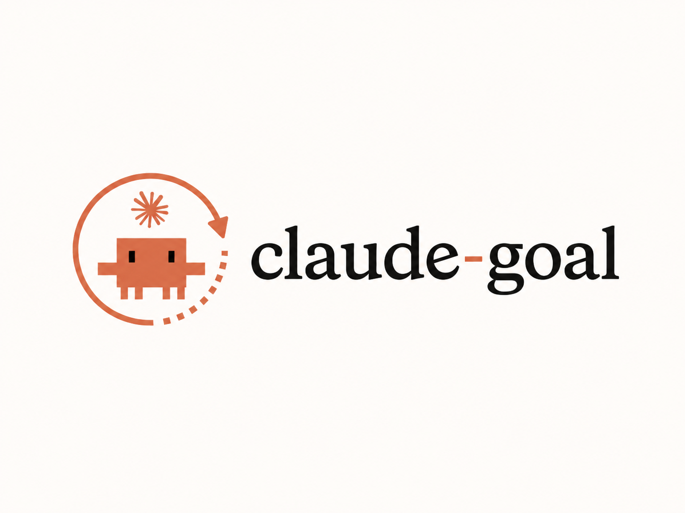
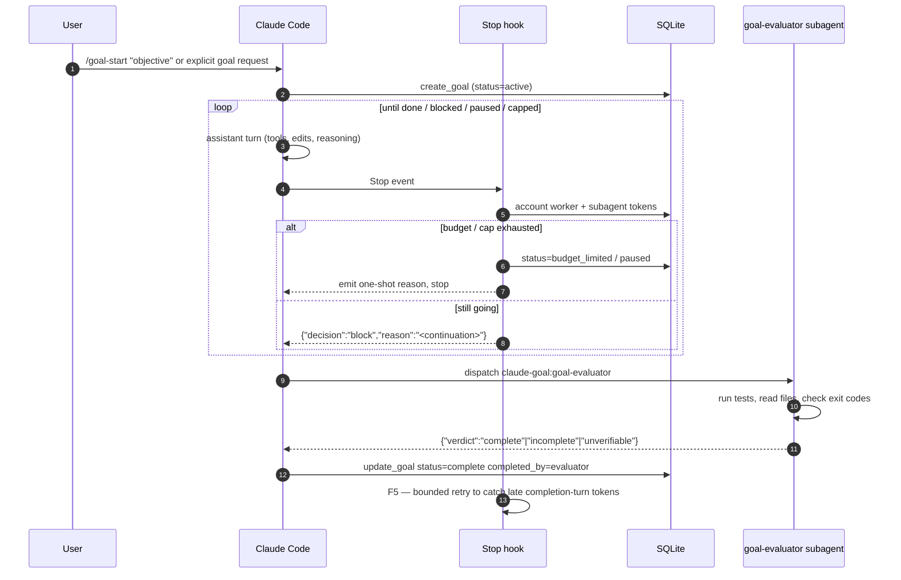

<p align="center">
  <a href="https://nuko-nova-dynamics.github.io/claude-goal/">
    
  </a>
</p>

<p align="center">
  <em>Goal-bounded autonomous turns for Claude Code. Say "set up a goal" or use /goal-start, pick a budget profile when you need one, walk away.</em>
</p>

<p align="center">
  <a href="https://github.com/nuko-nova-dynamics/claude-goal/releases/latest"></a>
  <a href="https://github.com/nuko-nova-dynamics/claude-goal/blob/main/LICENSE"></a>
  <a href="https://github.com/nuko-nova-dynamics/claude-goal/actions/workflows/test.yml"></a>
  
  
</p>

<p align="center">
  <a href="https://nuko-nova-dynamics.github.io/claude-goal/">Docs</a>
  &nbsp;·&nbsp;
  <a href="#install">Install</a>
  &nbsp;·&nbsp;
  <a href="#commands">Commands</a>
  &nbsp;·&nbsp;
  <a href="#how-it-works">How it works</a>
  &nbsp;·&nbsp;
  <a href="ROADMAP.md">Roadmap</a>
</p>

---

> [!NOTE]
> **Public beta.** The happy path is real-Claude-validated end-to-end across five acceptance scenarios; outside-user miles are still accumulating. File issues against anything surprising.

## What is this

`claude-goal` is a Claude Code plugin that drives the agent through an autonomous loop until a goal is provably met. Type `/goal-start "objective"` or explicitly tell Claude "set up a goal for this and continue" and the agent self-iterates — each turn ends in a Stop-hook continuation that feeds the next prompt — until **one** of the following: the model passes its own completion audit, the work is genuinely blocked, a budget profile or raw token budget exhausts, the turn count exhausts, the wall-clock cap exhausts, or you stop it.

It's a production-grade companion to Claude Code 2.1.139+'s built-in `/goal`. The native command is great for casual conditions; this plugin adds **deterministic budgets, lifecycle controls, `/compact` recovery, persistence across restarts, and a tool-equipped evaluator subagent** that verifies completion by running tests / reading files / checking exit codes — not by trusting the worker's self-narrative.

## vs Claude Code's built-in `/goal`

| | Built-in `/goal` (2.1.139+) | `claude-goal` |
|---|---|---|
| Autonomous continuation | ✓ | ✓ |
| Budget control | phrase in condition | deterministic profiles (`quick`, `standard`, `deep`, `overnight`, `auto`) or raw token caps |
| Turn / time caps | phrase in condition | profile-sized hard caps, `/goal-extend` to raise |
| Pause · resume · abandon | `/goal clear` only | `/goal-pause`, `/goal-resume`, `/goal-abandon` |
| Blocked-state recovery | prompt-only | `status=blocked`, visible status, `/goal-resume` |
| `/compact` recovery | n/a | `accounting_uncertain` flag + `/goal-reconcile` |
| Restart persistence | counters reset | SQLite preserves everything |
| Completion judgment | fresh Haiku per turn (transcript-only) | dual path — worker self-audit **and** a plugin subagent that verifies with **tools** |

Run them side-by-side. They don't collide.

## Quickstart

```bash
# Install from the Nuko Nova Tools marketplace
/plugin marketplace add nuko-nova-dynamics/claude-marketplace
/plugin install claude-goal@nuko-nova-tools

# Start a goal
/goal-start "list all .ts files under src/ and print a line count for each"

# Natural-language goal starts work too. Claude derives the objective and uses --budget auto.
set up a goal and refactor the auth module to use async/await, then keep going

# Or pick a run profile. Profiles set token, continuation, and wall-clock caps.
/goal-start "refactor the auth module to use async/await" --budget standard
```

Claude confirms the goal, begins working, and continues across turns without further prompting. When it decides the objective is met, it dispatches the evaluator subagent for verification, then calls `update_goal` and stops.

> [!TIP]
> Start with profile names, not raw token math: `quick` (500K tokens, 25 turns, 1h), `standard` (2M, 75 turns, 4h), `deep` (5M, 150 turns, 8h), `overnight` (20M, 500 turns, 12h), or `auto` for deterministic objective-based selection. Omitting `--budget` on `/goal-start` remains unbounded. Explicit natural-language goal starts use `auto` unless you ask for another profile, raw token budget, or unbounded mode. Raw token numbers still work for advanced tuning. See [`docs/concepts/budgets`](https://nuko-nova-dynamics.github.io/claude-goal/concepts/budgets/) for details.

## How it works



<details>
<summary><strong>Mechanics in a paragraph each</strong></summary>

**Stop hook — continuation injection.** After every turn `scripts/stop.sh` fires. If a goal is `active`, the hook emits `{"decision":"block","reason":"<continuation prompt>"}` and Claude Code feeds that prompt back to the model. The continuation prompt — adapted from Codex's `continuation.md` — reminds the model of the objective and asks it to either keep working or call `update_goal` if done.

**Token accounting.** `scripts/post-tool-batch.sh` reads the session transcript JSONL after every tool batch, finds assistant messages past the last cursor, and sums `input_tokens + cache_creation_input_tokens + output_tokens`. Cache-read tokens are excluded. Parent-worker counts go to `tokens_used`; subagent counts go to `subagent_tokens` through per-agent cursors stored in `subagent_token_cursors`.

**Completion — dual path.** The worker can self-audit and call `update_goal status:complete` (`completed_by: "self_update"`). The continuation prompt also instructs the worker to dispatch the `claude-goal:goal-evaluator` subagent before declaring done. The evaluator runs in a fresh context with `Bash + Read + jq + sqlite3` — it reads the objective from the DB, queries real state with tools, and returns `{"verdict":"complete"|"incomplete"|"unverifiable"}`. On `complete`, the worker calls `update_goal completed_by:"evaluator"`, which logs a distinct `goal_completed_by_evaluator` event. Evaluator completion can also close a goal paused by `accounting_error` after `/compact`; self-update completion cannot bypass that accounting pause. The two paths coexist; evaluator is preferred, self-audit is the fallback.

**Blocked state.** If the same blocker repeats across at least three consecutive continuation turns and no meaningful progress is possible without user input or an external-state change, the worker can call `update_goal status:blocked blocked_reason:"..."`. Blocked goals stop auto-continuing, stay visible in status/history, and can be restarted with `/goal-resume`.

**Budget / cap enforcement.** At goal creation, a named profile expands into a token budget, continuation cap, and wall-clock cap; raw token budgets remain token-only. At the start of each Stop hook run, the hook checks `(tokens_used + subagent_tokens) >= token_budget`, `continuations_remaining <= 0`, and elapsed wall-clock. Token-budget breaches transition to `budget_limited`; continuation and wall-clock caps transition to `paused` with `paused_reason` set.

**F5 final-turn accounting.** The completion turn's tokens are captured by a bounded retry loop after `detect_update_goal` returns true, and again when `update_goal` has already moved the row to `complete` before Stop reads the final transcript bytes. Five retries at 100ms intervals re-run `account_advance_inline` to catch transcripts that flush after the start-of-hook accounting pass.

**State store.** All goal state lives in SQLite at `${CLAUDE_PLUGIN_DATA}/goals.db` (WAL mode). The `goals` table records status, token counts, selected budget profile/source, continuation budget, wall-clock usage, and a full audit log in `goal_events`. Schema is migration-versioned through v4, including subagent cursor storage, the `blocked` lifecycle state, and budget profile provenance.

**MCP tools.** The bundled MCP server (`mcp/goal-server`) exposes `create_goal`, `get_goal`, `update_goal`. The `/goal-start` skill and explicit natural-language goal-start requests invoke `create_goal`; the worker invokes `update_goal` on completion or a genuine blocker; all other lifecycle ops go through `scripts/goal-cli.sh`.

</details>

## Commands

| Command | What it does |
|---|---|
| `/goal-start "objective" [--budget quick\|standard\|deep\|overnight\|auto\|N]` or explicit prose like "set up a goal for this" | Start a new goal. Omit `--budget` on slash form for unbounded; explicit prose defaults to `auto`. Replaces any prior completed/abandoned goal for this session. |
| `/goal-status` | Current goal, status, selected budget profile/source, worker + subagent tokens, continuations remaining, warnings. |
| `/goal-pause` · `/goal-resume` | User pause/resume, or resume a blocked goal. |
| `/goal-abandon` (`/goal-stop`) | Abandon permanently. Stops the auto-continuation loop. |
| `/goal-extend --add-continuations N` | Raise turn cap on a `continuation_cap`-paused goal and resume. |
| `/goal-extend --add-hours N` | Raise wall-clock cap on a `wall_clock_cap`-paused goal and resume. |
| `/goal-extend --add-tokens N` | Raise token budget and resume a `budget_limited` goal. |
| `/goal-reconcile --accept-reset` | Clear the `accounting_uncertain` flag set after `/compact`. Resets accounting to the current transcript cursor. |
| `/goal-doctor` | Preflight self-test: SQLite, MCP connectivity, hook registration, shell deps. |
| `/goal-history [--all] [--format=json]` | Tracked goals for this session, or `--all` for cross-session, sorted newest first. |
| `/goal-cleanup --list` · `--delete [--older-than HOURS]` | Surface and reap orphaned goals left by `/clear`. |

## Install

### From the Nuko Nova Tools marketplace (recommended)

```
/plugin marketplace add nuko-nova-dynamics/claude-marketplace
/plugin install claude-goal@nuko-nova-tools
```

Updates land via `/plugin update claude-goal` once new versions are tagged.

<details>
<summary><strong>From the release tarball</strong> (offline / air-gapped)</summary>

```bash
mkdir -p ~/.claude/plugins/local/claude-goal
tar -xzf claude-goal-v0.2.4.tar.gz -C ~/.claude/plugins/local/claude-goal
claude --plugin-dir ~/.claude/plugins/local/claude-goal
```

The tarball ships the prebuilt MCP `dist/`, pruned production dependencies under `mcp/goal-server/node_modules/`, `LICENSE`, `RELEASE_NOTES.md`, and `ROADMAP.md`. No package-manager install needed on the target machine beyond a Node 22 runtime.
</details>

<details>
<summary><strong>From git</strong> (development / contributors)</summary>

```bash
git clone https://github.com/nuko-nova-dynamics/claude-goal.git
cd claude-goal
(cd mcp/goal-server && npm ci && npm run build)
claude --plugin-dir "$PWD"
```
</details>

## Optional statusline

```json
{
  "statusLine": {
    "type": "command",
    "command": "/path/to/claude-goal/statusline/status.sh"
  }
}
```

Renders one of:

- `◎ goal active (1.2M / 5M)` — active with budget
- `◎ goal active (800K)` — active, no budget
- `◎ goal paused (user)` — user paused
- `◎ goal blocked` — blocked until user input or external state changes
- `◎ goal unmet (budget exhausted)` — budget hit
- `◎ goal achieved` — complete

## Known limitations

- **macOS · Linux · WSL only.** Native Windows triggers a fail-fast guard in `stop.sh`. WSL is best-effort and untested.
- **Auto-mode classifier may block `update_goal`.** Use concrete, achievable objectives ("add a `--verbose` flag to the CLI" — not "do the task").
- **`/clear` orphans the active goal.** Use `/goal-abandon` before clearing, or `/goal-cleanup` to reap orphan rows later.
- **Final-turn accounting is bounded.** F5 catches late completion-turn transcript flushes with five 100ms retries. If Claude Code flushes completion usage after that window, a tiny residual undercount is still possible — the retry is intentionally bounded so Stop hooks do not hang.
- **Plugin upgrade lifecycle is undocumented upstream.** After updating plugin files, run `claude restart` to reload the MCP server. Hot-reload is not guaranteed.

## Platform support

| Platform | Status |
|---|---|
| macOS | Tested |
| Linux | Tested |
| WSL | Best-effort, untested |
| Native Windows | Fail-fast guard — not supported |

## Develop

```bash
# Bats — hooks, skills, integration loops, release packaging, regression probes
bats $(find tests -name '*.bats' | sort)

# Vitest — MCP server, migrations, tools, token math, fixtures
npm --prefix mcp/goal-server test
```

Roadmap and design notes live in [`ROADMAP.md`](ROADMAP.md). Full docs at **[nuko-nova-dynamics.github.io/claude-goal](https://nuko-nova-dynamics.github.io/claude-goal/)**.

## Acknowledgments

The autonomous loop mechanism — Stop hook injecting a continuation prompt, model self-driving until a completion signal — is ported from OpenAI Codex's `/goal` feature (`codex-rs`). The `continuation.md` and `budget-limit.md` prompt templates in `prompts/` are adapted from Codex's `core/templates/goals/` with minor modifications for Claude Code's hook API.

## License

MIT © Nuko Nova Dynamics
