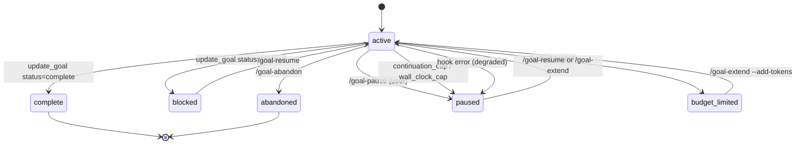

`claude-goal` is designed for **hour-long autonomous runs across many turns**. You can leave a goal unbounded, or you can pick a human-sized run profile that sets the token budget, continuation cap, and wall-clock cap together.

There are three independent caps. **Any one of them firing pauses the goal.**

| Cap | Default when omitted | How to set | Paused reason |
|---|---|---|---|
| Token budget | none (unlimited) | `/goal-start "..." --budget <profile-or-number>` | `budget_limited` |
| Continuation cap | 50 turns | profile bundle or `/goal-extend --add-continuations N` | `continuation_cap` |
| Wall-clock cap | 4 hours | profile bundle or `/goal-extend --add-hours N` | `wall_clock_cap` |

## Budget profiles

Use profile names first. They encode the common envelopes without making users type raw token counts.

| Profile | Token budget | Continuations | Wall-clock | Use it for |
|---|---:|---:|---:|---|
| `quick` | 500K | 25 | 1h | Small, narrow, single-file, or inspection-style tasks. |
| `standard` | 2M | 75 | 4h | Bounded features, bug fixes with tests, and medium refactors. |
| `deep` | 5M | 150 | 8h | Migrations, repo-wide refactors, redesigns, integrations, multi-module work, or many named files. |
| `overnight` | 20M | 500 | 12h | Explicit overnight, weekend, or similarly long unattended runs. |
| `auto` | selected profile | selected profile | selected profile | Deterministically picks one of the profiles from the objective text. |
| no `--budget` | unlimited | 50 | 4h | Open-ended exploration you plan to monitor manually. |

`auto` is deterministic, not model-judged. It selects `overnight` only for explicit overnight/weekend-style wording; `deep` for broad migrations, repo-wide refactors, redesigns, integrations, multi-module changes, or many named files; `standard` for bounded features, bug fixes with tests, or medium refactors; and `quick` for small inspection-style work.

## Advanced raw token budgets

Raw token numbers still work for exact control and backward compatibility:

```
/goal-start "refactor the auth module to use async/await" --budget 3000000
```

Raw numbers set only `token_budget`. They do **not** resize the default 50 continuation turns or 4-hour wall-clock cap. Extend those separately with `/goal-extend --add-continuations N` or `/goal-extend --add-hours N`.

If you use raw numbers, size them in **millions of tokens, not thousands**. A typical Claude Code message in a real codebase is already 50K-100K tokens of input on its own. Budgets under 200K will almost certainly cap on turn one, which makes the plugin look broken when it is actually enforcing the number you gave it.

## How the math works

At the start of each Stop hook run, the hook checks:

```
(tokens_used + subagent_tokens) >= token_budget
```

If true, the goal transitions to `status=budget_limited` and the hook emits a one-shot **budget-limit** prompt that tells the model to stop trying to continue.

The budget includes **both** worker and subagent tokens. A goal that dispatches a heavy evaluator can still hit the cap.

### What counts

Tokens are summed from the transcript JSONL as:

```
input_tokens + cache_creation_input_tokens + output_tokens
```

`cache_read_input_tokens` is intentionally excluded — those tokens don't bill new context. Budgets measure **billable work**, not raw API throughput.

This matters for sizing: once a long-running goal has warmed the cache, per-turn token cost drops sharply (input cache reads are free against the budget). The first few turns are heavy; later turns are cheap. A 2M-token budget often goes much further than 2M / per-turn-average would suggest.

### Raising a budget mid-run

When a goal reaches `status=budget_limited`, you have two practical options:

**Raise the token budget and resume.** If progress is still useful and the cap was simply too small:

```
/goal-extend --add-tokens 1000000
```

This adds 1M tokens to the existing budget, resets the one-shot budget-limit prompt, and resumes the goal.

**Start a fresh goal with a larger profile.** Use this when the objective needs to be narrowed or the current run is looping:

```
/goal-abandon
/goal-start "<refined objective>" --budget deep
```

## Continuation cap

Unprofiled goals and raw-token goals start with **50 continuation turns**. Profiles override that cap: `quick` has 25, `standard` has 75, `deep` has 150, and `overnight` has 500. After each Stop hook fire, `continuations_remaining` decrements. When it hits 0, the hook transitions to `status=paused`, `paused_reason=continuation_cap`.

```
/goal-extend --add-continuations 100
```

…raises the cap and resumes. The model sees a regular continuation prompt on its next turn — no special "extended" indicator.

For long-running goals, prefer `deep` or `overnight` up front. If the goal still needs more turns, extend continuations explicitly.

## Wall-clock cap

Unprofiled goals, raw-token goals, and `standard` goals start with a **4-hour wall-clock cap** measured from `started_at`. `quick` gets 1 hour, `deep` gets 8 hours, and `overnight` gets 12 hours. After each Stop hook fire, the hook checks `elapsed_wall_clock`. When it exceeds the cap, the hook transitions to `status=paused`, `paused_reason=wall_clock_cap`.

```
/goal-extend --add-hours 8
```

…adds 8 hours to the wall-clock cap and resumes.

The wall-clock cap exists for runaway protection — a goal looping on an unverifiable objective (e.g. "wait until the build completes" with no build running) can churn turns indefinitely without producing meaningful work. The cap forces a human checkpoint. For overnight or weekend runs, use `--budget overnight` or extend the wall-clock cap explicitly.

## Worker vs subagent attribution

Token usage is split between two columns in the `goals` table:

- `tokens_used` — accumulated parent-worker tokens
- `subagent_tokens` — accumulated subagent tokens, summed across all `agent_id`s

This split is informational — for budget enforcement, both columns are summed. But it's useful for `/goal-history --format=json` post-hoc analysis, especially when the evaluator subagent is doing significant verification work.

Per-subagent cursors live in `subagent_token_cursors` (one row per `agent_id`). This allows multiple subagents in a single goal to be accounted independently.

## Status transitions



## The honest cheat sheet

If you remember nothing else from this page:

- Omit `--budget` for an unbounded token budget.
- Use `--budget quick` for small inspection-style tasks.
- Use `--budget standard` for bounded implementation work.
- Use `--budget deep` for broad repo work.
- Use `--budget overnight` only when you explicitly mean a long unattended run.
- Use raw token numbers only when you need exact control.
