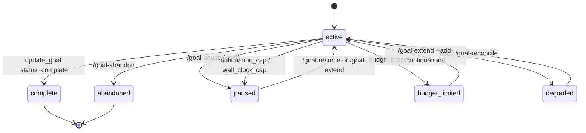

`claude-goal` has three independent budgets. **Any one of them firing pauses the goal.**

| Budget | Default | How to set | Paused reason |
|---|---|---|---|
| Token budget | none (unlimited) | `/goal-start "..." --budget N` | `budget_limited` |
| Continuation cap | 50 turns | (built-in) | `continuation_cap` |
| Wall-clock cap | 4 hours | (built-in) | `wall_clock_cap` |

## Token budget

The token budget is the only one set per-goal. Pass it at start:

```
/goal-start "refactor the auth module" --budget 50000
```

At the start of each Stop hook run, the hook checks:

```
(tokens_used + subagent_tokens) >= token_budget
```

If true, the goal transitions to `status=budget_limited` and the hook emits a one-shot **budget-limit** prompt that tells the model to stop trying to continue.

The budget includes **both** worker and subagent tokens. A goal that spawns a heavy evaluator can still hit the cap.

### Cache-read exclusion

Tokens are summed from the transcript JSONL as:

```
input_tokens + cache_creation_input_tokens + output_tokens
```

`cache_read_input_tokens` is intentionally excluded — those tokens don't bill new context against the budget. This means budgets measure **billable work**, not raw API throughput.

### Raising a budget mid-run

Once paused with `budget_limited`, you have two choices:

**Raise the continuation cap to resume** with the existing token total:

```
/goal-extend --add-continuations 10
```

This adds turns but **does not** raise the token budget. If the goal is over budget, it'll re-pause immediately.

**Start a fresh goal** with a larger budget:

```
/goal-abandon
/goal-start "<same objective>" --budget 100000
```

A "raise the token budget" extender is on the roadmap; for now, abandon + restart is the pattern.

## Continuation cap

Every goal starts with 50 continuation turns. After each Stop hook fire, `continuations_remaining` decrements. When it hits 0, the hook transitions to `status=paused`, `paused_reason=continuation_cap`.

```
/goal-extend --add-continuations 20
```

…raises the cap and resumes the goal. The model sees a regular continuation prompt on its next turn — no special "extended" indicator.

## Wall-clock cap

Every goal starts with a 4-hour wall-clock cap measured from `started_at`. After each Stop hook fire, the hook checks `elapsed_wall_clock`. When it exceeds the cap, the hook transitions to `status=paused`, `paused_reason=wall_clock_cap`.

```
/goal-extend --add-hours 2
```

…adds 2 hours to the wall-clock cap and resumes.

The wall-clock cap is intentional protection against runaway goals — a goal that loops on an unverifiable objective (e.g. "wait until the build completes" with no build running) can churn turns indefinitely without producing meaningful work. The cap forces a human checkpoint.

## Worker vs subagent attribution

Token usage is split between two columns in the `goals` table:

- `tokens_used` — accumulated parent-worker tokens
- `subagent_tokens` — accumulated subagent tokens, summed across all `agent_id`s

This split is informational — for budget enforcement, both columns are summed. But it's useful for `/goal-history --format=json` post-hoc, especially when the evaluator subagent is doing significant work.

Per-subagent cursors live in `subagent_token_cursors` (one row per `agent_id`). This allows multiple subagents in a single goal to be accounted independently.

## Status transitions



## When to use a budget

| Situation | Recommendation |
|---|---|
| Exploratory "let me see how far it gets" | No budget. Use `/goal-status` to monitor. |
| Bounded refactor with clear acceptance | `--budget 30000` to start. Re-budget if it pauses near done. |
| Overnight long-running goal | `--budget 200000` + raise wall-clock cap with `/goal-extend --add-hours 8`. |
| Sanity check on a small task | `--budget 10000`. If it hits the cap, the model is in a loop. |
