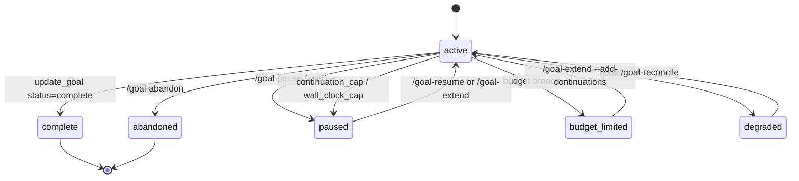

`claude-goal` is designed for **hour-long autonomous runs across hundreds of turns**. That means budgets are measured in **millions of tokens, not thousands**. A typical Claude Code message in a real codebase is already 50k–100k tokens of input on its own — a meaningful goal needs orders of magnitude more headroom.

There are three independent budgets. **Any one of them firing pauses the goal.**

| Budget | Default | How to set | Paused reason |
|---|---|---|---|
| Token budget | none (unlimited) | `/goal-start "..." --budget N` | `budget_limited` |
| Continuation cap | 50 turns | (built-in) | `continuation_cap` |
| Wall-clock cap | 4 hours | (built-in) | `wall_clock_cap` |

## Sizing a token budget

The cheap-and-correct framing: pick the budget for the **shape of the goal**, not for a hopeful low-water mark.

| Goal shape | Realistic budget | Why |
|---|---|---|
| Small one-shot task, single file, no evaluator needed | `--budget 500000` (500K) | One reading turn + a few editing turns + one evaluator pass easily clears 200–400K. Budget at 500K so you don't trip prematurely. |
| Bounded refactor with tests | `--budget 2000000` (2M) | Read a handful of files, write changes, run tests, address evaluator feedback, iterate twice. |
| Multi-file refactor or migration | `--budget 5000000` (5M) | A real cross-cutting change across 10+ files with verification. |
| Overnight long-running goal | `--budget 20000000` (20M) + `/goal-extend --add-hours 8` | Pair with continuation extensions as it hits caps. |
| Truly open-ended exploration | no budget | Monitor with `/goal-status` and abandon if it goes sideways. |

**One number to remember**: 50K is roughly *one Claude Code input turn* in a real codebase. Budgets under 200K will almost certainly cap on turn one, which makes the plugin look broken when it's actually doing its job.

## How the math works

At the start of each Stop hook run, the hook checks:

```
(tokens_used + subagent_tokens) >= token_budget
```

If true, the goal transitions to `status=budget_limited` and the hook emits a one-shot **budget-limit** prompt that tells the model to stop trying to continue.

The budget includes **both** worker and subagent tokens. A goal that dispatches a heavy evaluator can still hit the cap.

### What counts

Tokens are summed from the transcript JSONL as:

```
input_tokens + cache_creation_input_tokens + output_tokens
```

`cache_read_input_tokens` is intentionally excluded — those tokens don't bill new context. Budgets measure **billable work**, not raw API throughput.

This matters for sizing: once a long-running goal has warmed the cache, per-turn token cost drops sharply (input cache reads are free against the budget). The first few turns are heavy; later turns are cheap. A 2M-token budget often goes much further than 2M / per-turn-average would suggest.

### Raising a budget mid-run

When a goal pauses with `budget_limited`, you have two practical options:

**Add turns, accept overrun.** If you trust the model to wrap up:

```
/goal-extend --add-continuations 50
```

This adds turns and resumes, but **does not** raise the token budget. The next Stop hook will re-detect over-budget and re-pause unless you also accept that the goal will continue burning tokens past the cap.

**Start a fresh goal with a larger budget.** The clean reset:

```
/goal-abandon
/goal-start "<refined objective>" --budget 5000000
```

A "raise the token budget" extender is on the roadmap; for now, abandon + restart is the pattern when you want a real cap raise.

## Continuation cap

Every goal starts with **50 continuation turns**. After each Stop hook fire, `continuations_remaining` decrements. When it hits 0, the hook transitions to `status=paused`, `paused_reason=continuation_cap`.

```
/goal-extend --add-continuations 100
```

…raises the cap and resumes. The model sees a regular continuation prompt on its next turn — no special "extended" indicator.

For long-running goals, expect to extend continuations multiple times. 50 turns is a sanity floor, not a hard ceiling — autonomous refactors regularly need 200–500 turns to land cleanly.

## Wall-clock cap

Every goal starts with a **4-hour wall-clock cap** measured from `started_at`. After each Stop hook fire, the hook checks `elapsed_wall_clock`. When it exceeds the cap, the hook transitions to `status=paused`, `paused_reason=wall_clock_cap`.

```
/goal-extend --add-hours 8
```

…adds 8 hours to the wall-clock cap and resumes.

The wall-clock cap exists for runaway protection — a goal looping on an unverifiable objective (e.g. "wait until the build completes" with no build running) can churn turns indefinitely without producing meaningful work. The cap forces a human checkpoint. For overnight or weekend runs, raise it explicitly.

## Worker vs subagent attribution

Token usage is split between two columns in the `goals` table:

- `tokens_used` — accumulated parent-worker tokens
- `subagent_tokens` — accumulated subagent tokens, summed across all `agent_id`s

This split is informational — for budget enforcement, both columns are summed. But it's useful for `/goal-history --format=json` post-hoc analysis, especially when the evaluator subagent is doing significant verification work.

Per-subagent cursors live in `subagent_token_cursors` (one row per `agent_id`). This allows multiple subagents in a single goal to be accounted independently.

## Status transitions



## The honest cheat sheet

If you remember nothing else from this page:

- Goals run for **hours and hundreds of turns**, not minutes.
- A single message in a real codebase is **50–100K tokens** of input.
- **`--budget 500000` is your floor** for a meaningful run.
- **`--budget 2000000`+** is the comfortable range for real work.
- **No budget at all** is fine for exploration — monitor with `/goal-status` and abandon if it goes sideways.
- Caps exist for runaway protection, not cost control. Raise them when you mean to run long.
