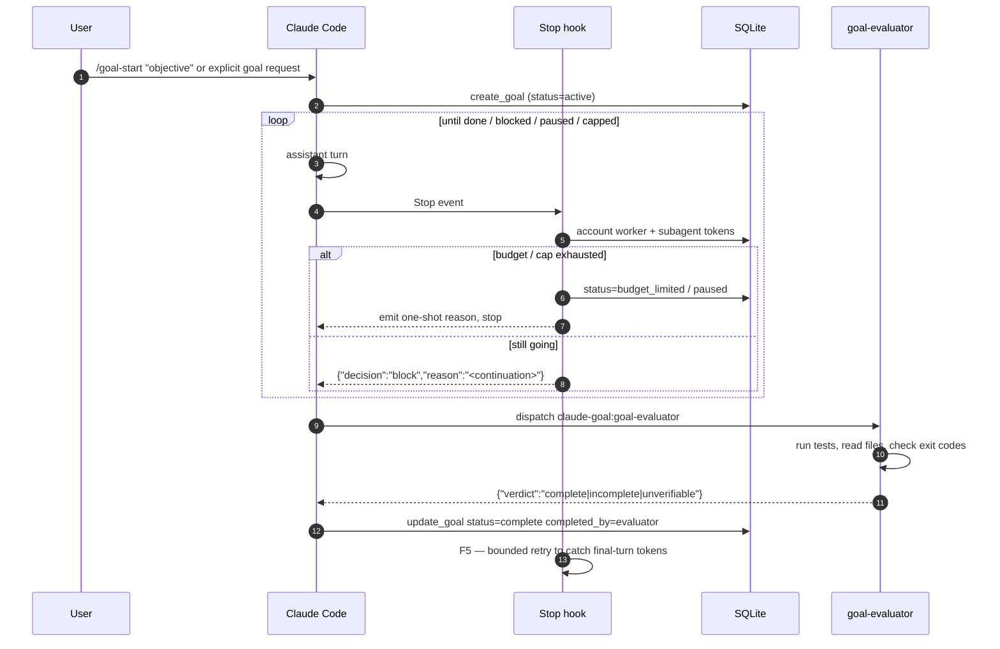

`claude-goal` is built around six pieces that hand off to one another every turn. This page walks through each piece in execution order.

## The loop



## 1. Stop-hook continuation

After every assistant turn, `scripts/stop.sh` fires. The hook:

1. Reads the session ID from the Stop event payload
2. Looks up the active goal for that session
3. Accounts new tokens since the last cursor
4. Checks budget, continuation cap, and wall-clock cap
5. If still going, emits `{"decision":"block","reason":"<continuation prompt>"}` — Claude Code feeds that prompt back to the model
6. If a cap fired, transitions status and emits a one-shot reason
7. If the worker has already called `update_goal status:complete` or `status:blocked`, stays silent

The continuation prompt template lives in `prompts/continuation.md` — adapted from OpenAI Codex's `core/templates/goals/continuation.md` with modifications for Claude Code's hook API.

## 2. Token accounting

`scripts/post-tool-batch.sh` runs after every tool batch. It reads the session transcript JSONL, finds assistant messages newer than the last cursor, and sums:

```
input_tokens + cache_creation_input_tokens + output_tokens
```

Cache-**read** tokens are excluded — they don't count against the budget because they don't bill new context.

Parent-worker counts go to `goals.tokens_used`. Subagent counts go to `goals.subagent_tokens`, keyed by `agent_id` in `subagent_token_cursors` so each subagent has its own cursor and you can attribute usage per-agent post-hoc.

## 3. Completion and blockers

Completion can fire from either path:

**Worker self-audit.** The worker calls `update_goal` with `status: "complete"`. The MCP tool logs a `goal_completed_by_self_update` event. Fast, but vulnerable to the worker's sunk-cost bias — a model that has spent N turns working toward an objective leans toward declaring done.

**Evaluator subagent.** The continuation prompt instructs the worker to dispatch `claude-goal:goal-evaluator` before marking complete. The subagent runs in a fresh context (no inherited conversation, no sunk-cost bias) with `Bash + Read + jq + sqlite3`. It reads the objective from the DB, inspects recent transcript state, **and verifies with tools** — run the test, read the file, check the exit code. Returns `{"verdict":"complete|incomplete|unverifiable","reason":"..."}`. On `complete`, the worker calls `update_goal` with `completed_by: "evaluator"`, logging a distinct `goal_completed_by_evaluator` event.

The evaluator prompt is conservative by design: **optimistic language is never proof**. Vague "should work now" → `incomplete`. Explicit evidence (exit codes, file contents, test reports) → `complete`.

**Blocked state.** The worker can call `update_goal` with `status: "blocked"` only when the same blocker repeats across at least three consecutive continuation turns and no meaningful progress is possible without user input or an external-state change. Blocked goals stop auto-continuing, remain auditable in `goal_events`, and can be restarted with `/goal-resume`.

## 4. Budget and cap enforcement

At the start of every Stop hook run:

| Check | Action on breach |
|---|---|
| `tokens_used + subagent_tokens >= token_budget` | `status=budget_limited`, emit budget-limit prompt |
| `continuations_remaining <= 0` | `status=paused`, `paused_reason=continuation_cap` |
| `elapsed_wall_clock >= wall_clock_cap` | `status=paused`, `paused_reason=wall_clock_cap` |
| Catch-all error in hook | `status=paused`, `paused_reason=degraded` |

Named profiles expand during `create_goal`: `quick`, `standard`, `deep`, and `overnight` each set `token_budget`, `continuations_remaining`, and `max_wall_clock_seconds`. `auto` deterministically selects one of those profiles from the objective text. Raw numeric budgets set `token_budget` only.

`/goal-extend` is how you raise a cap and resume.

## 5. F5 — final-turn token accounting

The completion turn — the assistant turn that emits `update_goal` — can flush its usage to the transcript JSONL **after** the Stop hook has already done its accounting pass. Left unhandled, the completion turn's tokens would never be counted.

F5 fixes this with a bounded retry: after `detect_update_goal` returns true (or when `update_goal` has already moved the row to `complete` before Stop reads the final transcript bytes), the hook re-runs `account_advance_inline` up to **5 times at 100 ms intervals**. If the retry advances the byte offset, it logs a `final_turn_accounted` event.

The retry is intentionally bounded — Stop hooks must not hang. If Claude Code flushes completion usage after the 500 ms window, a tiny residual undercount is possible.

## 6. State store

All goal state lives in SQLite at `${CLAUDE_PLUGIN_DATA}/goals.db` (WAL mode).

| Table | Purpose |
|---|---|
| `goals` | One row per goal — status, token counts, budget profile/source, continuation budget, wall-clock usage, version (for optimistic concurrency) |
| `goal_events` | Full audit log — every status transition, completion event, accounting reset, cap fire, etc. |
| `subagent_token_cursors` | Per-`agent_id` byte cursor into each subagent's transcript JSONL |
| `schema_version` | Migration version (current: 4). Migration runner is in `mcp/goal-server/src/db.ts` — transactional, version-ordered, downgrade-protected. |

The `goals` table has a unique constraint on `session_id` for active goals, so a session can only own one live goal at a time.

## 7. MCP tools

The bundled MCP server (`mcp/goal-server`) exposes three tools:

| Tool | Caller | Effect |
|---|---|---|
| `create_goal` | `/goal-start` skill or explicit natural-language goal request | Insert a new goal row with either `budget_profile` or `token_budget`. Replaces any prior completed/abandoned goal for this session. |
| `get_goal` | Worker, evaluator subagent | Read the active goal — used by the evaluator to learn the objective. |
| `update_goal` | Worker on completion or genuine blocker | Transition to `complete` or `blocked`. `completed_by` enum distinguishes `self_update` from `evaluator` for completion. |

All other lifecycle operations (`pause`, `resume`, `abandon`, `extend`, `reconcile`, `cleanup`, `history`, `doctor`) go through `scripts/goal-cli.sh` — they're slash-command skills, not MCP tools.

## Reading the code

```text
mcp/goal-server/src/db.ts           # migration runner + connection helper
mcp/goal-server/src/goals-repo.ts   # CRUD + event logging
mcp/goal-server/src/token-math.ts   # sum logic, cache-read exclusion
mcp/goal-server/src/tools/          # create-goal, get-goal, update-goal
scripts/stop.sh                     # the continuation loop driver
scripts/post-tool-batch.sh          # token accounting
scripts/lib/accounting-core.sh      # account_advance_inline, F5 retry
scripts/lib/lease.sh                # session-scoped advisory lease
scripts/lib/render-template.sh      # XML-escape + substitute prompt vars
prompts/continuation.md             # what the model sees each turn
prompts/budget-limit.md             # one-shot prompt on budget breach
prompts/evaluator.md                # what the evaluator subagent reads
agents/goal-evaluator.md            # the evaluator subagent definition
```
